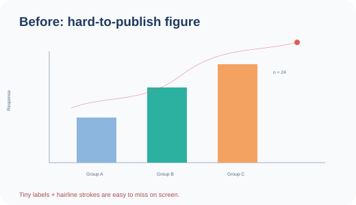
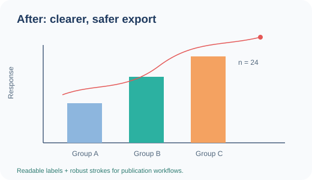

  

  
  
  
  

> **ESLint for academic figures.**

**FigureLint** is an open-source linter for academic figures. It helps researchers and students catch common technical quality issues before submission.

## Why

A figure can look fine on screen and still cause trouble during submission or production: low effective resolution, missing DPI metadata, tiny raster dimensions, accidental transparency, text converted to outlines, tiny labels, or strokes that become too thin in print.

FigureLint turns those checks into a repeatable command.

## See it in action

<table>
  <tr>
    <th>Before — easy-to-miss problems</th>
    <th>After — publication-safer export</th>
  </tr>
  <tr>
    <td></td>
    <td></td>
  </tr>
</table>

Run FigureLint on the deliberately problematic example:

~~~bash
figurelint check examples/svg/before.svg
~~~

Typical findings:

~~~text
warning  SVG_FONT_SMALL
Found 5 text element(s) below 7 pt; smallest resolved size is 5.00 pt.

warning  SVG_STROKE_THIN
Found 3 stroked element(s) below 0.5 pt; thinnest resolved stroke is 0.30 pt.
~~~

Now check the improved version:

~~~bash
figurelint check examples/svg/after.svg
~~~

It passes the current font-size and stroke-width checks with the default thresholds.

> The demo files are intentionally simple and fully editable so you can inspect exactly what FigureLint is measuring.

## Current checks

### PNG / JPEG

- unreadable/corrupt image files
- missing or low DPI metadata
- suspiciously small raster dimensions
- transparency that may need flattening for some workflows
- JPEG usage (informational, because it is lossy)

### SVG

- malformed/unreadable SVG files
- whether editable `<text>` elements are present
- suspiciously small resolvable font sizes
- suspiciously thin resolvable strokes
- simple CSS resolution for tag, class, id, and `tag.class` selectors
- inline style and SVG presentation-attribute resolution

See [SVG inspection details and assumptions](docs/SVG_CHECKS.md).

### PDF

- malformed/unreadable and password-protected PDF detection
- multi-page figure warnings
- unusually small or large page-size warnings
- editable-text detection
- font embedding checks
- effective DPI checks for embedded raster images
- raster soft-mask / alpha-channel detection

See [PDF inspection details and assumptions](docs/PDF_CHECKS.md).

### Presets

FigureLint can apply named threshold profiles across raster, SVG, and PDF checks.

~~~bash
figurelint presets
figurelint check figure.svg --preset high-resolution
figurelint check figures/ --preset journal-generic
figurelint check figure.pdf --preset nature
~~~

Explicit threshold options override the selected preset, so you can start from a profile and change only one value.

Most built-in profiles are FigureLint convenience presets — **not publisher policies**. The `nature` profile is source-verified against Nature's official final-submission guidance and prints its official source when used.

See [preset engine details](docs/PRESETS.md) and [Nature preset provenance](docs/NATURE.md).

### Workflow

- recursive folder scanning
- CI-friendly exit codes
- optional strict mode
- configurable thresholds and named presets

Planned next:

- PDF font-size and vector stroke checks
- color contrast and color-blind safety
- additional source-verified publisher presets
- GitHub Action annotations

## Install

Requires Python 3.10+.

~~~bash
git clone https://github.com/coocoomaomao/FigureLint.git
cd FigureLint
python -m venv .venv
pip install -e .
~~~

For development:

~~~bash
pip install -e ".[dev]"
pytest
~~~

## Usage

Check one figure:

~~~bash
figurelint check path/to/figure.svg
~~~

Check a whole folder:

~~~bash
figurelint check figures/
~~~

Use a preset:

~~~bash
figurelint check figures/ --preset high-resolution
figurelint check figure.pdf --preset nature
~~~

List available presets:

~~~bash
figurelint presets
~~~

Use stricter CI behavior so warnings fail the command:

~~~bash
figurelint check figures/ --strict
~~~

Customize raster thresholds:

~~~bash
figurelint check figure.png --min-dpi 300 --min-short-side 600
~~~

Customize SVG thresholds:

~~~bash
figurelint check figure.svg --min-font-size-pt 7 --min-stroke-width-pt 0.5
~~~

Check a PDF figure:

~~~bash
figurelint check figure.pdf
~~~

Customize PDF page-size guardrails:

~~~bash
figurelint check figure.pdf --min-pdf-short-side-in 1 --max-pdf-long-side-in 20
~~~

The existing `--min-dpi` option is also used for embedded raster images inside PDFs.

Example output:

~~~text
┏━━━━━━━━━━━━┳━━━━━━━━━━┳━━━━━━━━━━━━━━━━━┳━━━━━━━━━━━━━━━━━━━━━━━━━━━━━━┓
┃ File       ┃ Severity ┃ Code            ┃ Message                      ┃
┡━━━━━━━━━━━━╇━━━━━━━━━━╇━━━━━━━━━━━━━━━━━╇━━━━━━━━━━━━━━━━━━━━━━━━━━━━━━┩
│ figure.svg │ warning  │ SVG_FONT_SMALL  │ Found text below 7 pt.       │
└────────────┴──────────┴─────────────────┴──────────────────────────────┘
~~~

## Exit codes

- `0`: no errors; warnings are allowed unless `--strict` is used
- `1`: warnings found in strict mode
- `2`: one or more errors were found

## Brand assets

The official FigureLint visual system uses a **black cat + magnifying glass + check mark** in navy, teal, orange, and soft gray.

- [README banner](assets/figurelint-banner.svg)
- [Primary logo](assets/figurelint-logo.svg)
- [Icon / favicon source](assets/figurelint-icon.svg)
- [Dark-background logo](assets/figurelint-logo-dark.svg)
- [Social preview artwork](assets/figurelint-social-preview.svg)
- [Brand guide](docs/BRAND.md)

## Philosophy

FigureLint should flag **verifiable technical properties**, not pretend that every journal has the same rules. Thresholds are configurable, and future journal presets will be documented with their source guidelines.

## Contributing

Ideas, bug reports, and pull requests are welcome. The first milestones are tracked in GitHub Issues.

## License

MIT
